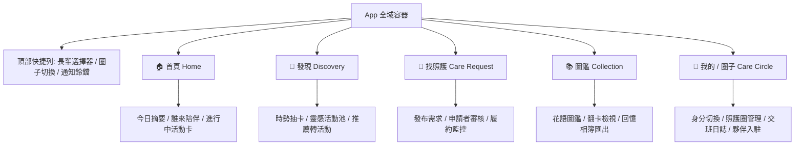
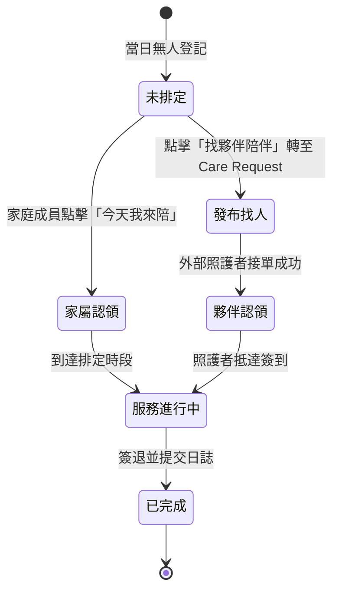
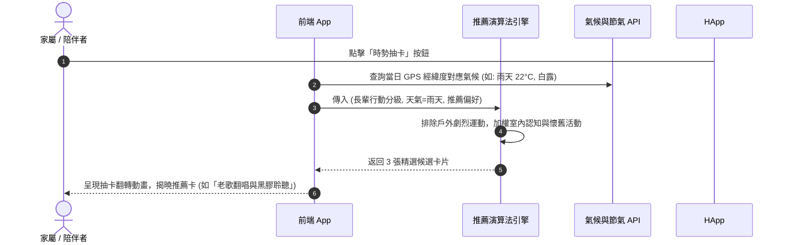
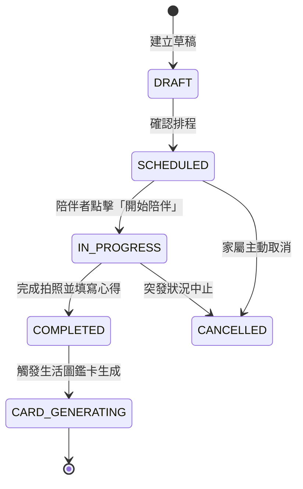
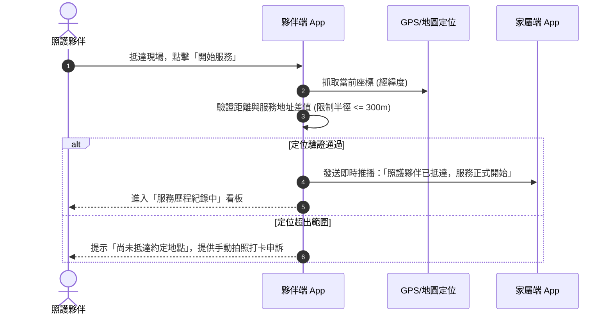
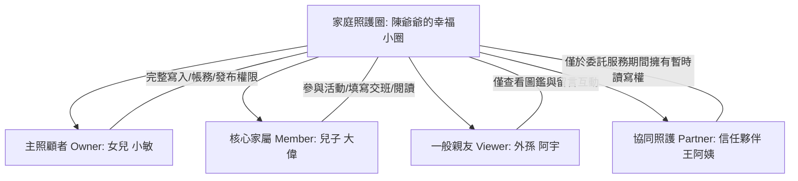
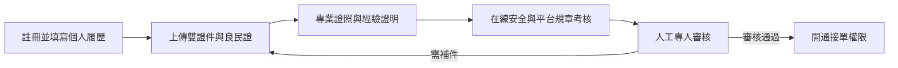
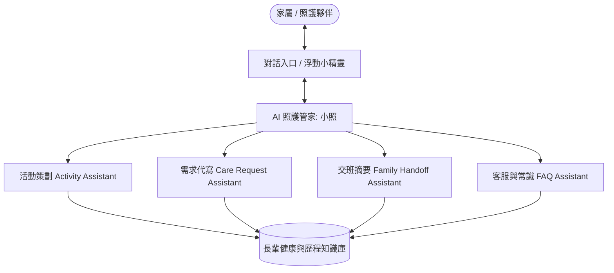
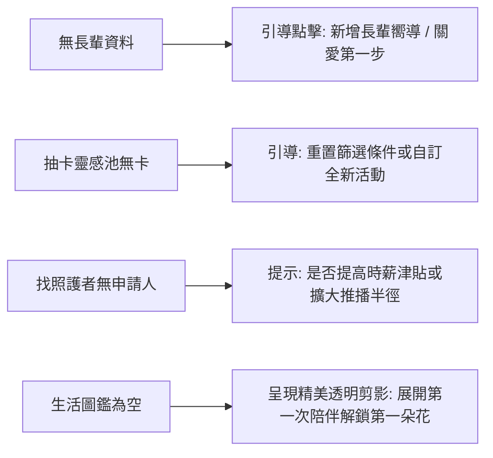

# 照護圈 (Care Circle) · 產品需求文件 (PRD)

---

## 📋 目錄 (Table of Contents)

- [02.00｜PRD OVERVIEW 產品綜述](#0200prd-overview-產品綜述)
  - [02.00.01 產品範疇 (Scope)](#020001-產品範疇-scope)
  - [02.00.02 產品核心閉環 (Product Loop)](#020002-產品核心閉環-product-loop)
  - [02.00.03 導覽架構與資訊層級 (Navigation & IA)](#020003-導覽架構與資訊層級-navigation--ia)
  - [02.00.04 優先級定義標準 (Priority Definition)](#020004-優先級定義標準-priority-definition)
  - [02.00.05 整體驗收原則 (Acceptance Principles)](#020005-整體驗收原則-acceptance-principles)
- [02.01｜HOME 首頁儀表板](#0201home-首頁儀表板)
  - [02.01.01 首頁視覺與功能佈局](#020101-首頁視覺與功能佈局)
  - [02.01.02 長輩切換機制](#020102-長輩切換機制)
  - [02.01.03 今日摘要 (Daily Digest)](#020103-今日摘要-daily-digest)
  - [02.01.04 今天誰陪？ (Companionship Status)](#020104-今天誰陪-companionship-status)
- [02.02｜ACTIVITY DISCOVERY 活動探索與抽卡](#0202activity-discovery-活動探索與抽卡)
  - [02.02.01 今天做什麼？ (Inspiration Feed)](#020201-今天做什麼-inspiration-feed)
  - [02.02.02 時勢抽卡機制 (Contextual Card Draw)](#020202-時勢抽卡機制-contextual-card-draw)
  - [02.02.03 再抽一次 (Re-roll Mechanism)](#020203-再抽一次-re-roll-mechanism)
  - [02.02.04 抽卡設定與篩選條件](#020204-抽卡設定與篩選條件)
  - [02.02.05 推薦轉化為 Activity (Convert to Activity)](#020205-推薦轉化為-activity-convert-to-activity)
- [02.03｜ACTIVITY 活動執行與記錄](#0203activity-活動執行與記錄)
  - [02.03.01 Activity 建立流程](#020301-activity-建立流程)
  - [02.03.02 Activity Detail 活動詳情](#020302-activity-detail-活動詳情)
  - [02.03.03 Activity 狀態機 (State Machine)](#020303-activity-狀態機-state-machine)
  - [02.03.04 Participant 參與者管理](#020304-participant-參與者管理)
  - [02.03.05 Photo 照片記錄與 AI 輔助捕捉](#020305-photo-照片記錄與-ai-輔助捕捉)
  - [02.03.06 Activity 完成與歸檔結算](#020306-activity-完成與歸檔結算)
- [02.04｜CARE REQUEST 照護需求發布與媒合](#0204care-request-照護需求發布與媒合)
  - [02.04.01 找照護者入口 (Caregiver Discovery)](#020401-找照護者入口-caregiver-discovery)
  - [02.04.02 Care Request 建立](#020402-care-request-建立)
  - [02.04.03 需求發布與推播媒合](#020403-需求發布與推播媒合)
  - [02.04.04 申請者清單與審核 (Applicants Review)](#020404-申請者清單與審核-applicants-review)
  - [02.04.05 選擇照護者與確認成單](#020405-選擇照護者與確認成單)
  - [02.04.06 取消需求與超時機制](#020406-取消需求與超時機制)
- [02.05｜CARE SERVICE 照護服務履約管理](#0205care-service-照護服務履約管理)
  - [02.05.01 服務開始與簽到打卡](#020501-服務開始與簽到打卡)
  - [02.05.02 服務進行中監控與歷程通報](#020502-服務進行中監控與歷程通報)
  - [02.05.03 服務完成與家屬確認](#020503-服務完成與家屬確認)
  - [02.05.04 例外狀況處理 (Exception Handling)](#020504-例外狀況處理-exception-handling)
- [02.06｜ACTIVITY CARD 活動紀念卡與花語系統](#0206activity-card-活動紀念卡與花語系統)
  - [02.06.01 卡片生成引擎 (Card Generation)](#020601-卡片生成引擎-card-generation)
  - [02.06.02 卡片正面設計 (Card Front)](#020602-卡片正面設計-card-front)
  - [02.06.03 卡片背面設計 (Card Back)](#020603-卡片背面設計-card-back)
  - [02.06.04 花語主題系統 (Flower Theme System)](#020604-花語主題系統-flower-theme-system)
  - [02.06.05 擬真翻卡互動 (Flip Interaction)](#020605-擬真翻卡互動-flip-interaction)
  - [02.06.06 卡片隱私與分享權限 (Privacy Settings)](#020606-卡片隱私與分享權限-privacy-settings)
- [02.07｜COLLECTION & MEMORY 生活圖鑑與回憶相簿](#0207collection--memory-生活圖鑑與回憶相簿)
  - [02.07.01 生活圖鑑展覽館 (Life Almanac)](#020701-生活圖鑑展覽館-life-almanac)
  - [02.07.02 多維度篩選 (Card Filter)](#020702-多維度篩選-card-filter)
  - [02.07.03 Card Detail 全螢幕卡片詳情](#020703-card-detail-全螢幕卡片詳情)
  - [02.07.04 回憶之書 (Memory Book) 自動彙編](#020704-回憶之書-memory-book-自動彙編)
- [02.08｜CARE CIRCLE 家庭照護圈](#0208care-circle-家庭照護圈)
  - [02.08.01 家庭照護圈架構](#020801-家庭照護圈架構)
  - [02.08.02 成員邀請機制 (Invite Mechanism)](#020802-成員邀請機制-invite-mechanism)
  - [02.08.03 成員角色與權限架構](#020803-成員角色與權限架構)
  - [02.08.04 家庭今日摘要 (Family Digest)](#020804-家庭今日摘要-family-digest)
  - [02.08.05 每日交班日誌 (Daily Handoff)](#020805-每日交班日誌-daily-handoff)
- [02.09｜CAREGIVER 照護夥伴體系](#0209caregiver-照護夥伴體系)
  - [02.09.01 Caregiver Profile 夥伴個人檔案](#020901-caregiver-profile-夥伴個人檔案)
  - [02.09.02 成為照護夥伴申請流程 (Onboarding)](#020902-成為照護夥伴申請流程-onboarding)
  - [02.09.03 認證申請表單 (Application Submission)](#020903-認證申請表單-application-submission)
  - [02.09.04 審核狀態追蹤 (Review Status)](#020904-審核狀態追蹤-review-status)
  - [02.09.05 受信任照護者認證 (Trusted Caregiver)](#020905-受信任照護者認證-trusted-caregiver)
- [02.10｜ACCOUNT & ROLE 多重角色與帳號管理](#0210account--role-多重角色與帳號管理)
  - [02.10.01 「我的」個人中心 (Profile & Settings)](#021001-我的個人中心-profile--settings)
  - [02.10.02 多身分模型 (Multi-role Architecture)](#021002-多身分模型-multi-role-architecture)
  - [02.10.03 角色切換互動 (Role Switch)](#021003-角色切換互動-role-switch)
  - [02.10.04 角色上下文資料隔離 (Role Context Isolation)](#021004-角色上下文資料隔離-role-context-isolation)
- [02.11｜AI ASSISTANT AI 照護協作員系統](#0211ai-assistant-ai-照護協作員系統)
  - [02.11.01 AI 照護協作員 (AI Care Companion - 小照)](#021101-ai-照護協作員-ai-care-companion---小照)
  - [02.11.02 Activity Assistant (活動策劃助手)](#021102-activity-assistant-活動策劃助手)
  - [02.11.03 Care Request Assistant (需求發布助手)](#021103-care-request-assistant-需求發布助手)
  - [02.11.04 Family Handoff Assistant (交班整理助手)](#021104-family-handoff-assistant-交班整理助手)
  - [02.11.05 AI Customer Service (智能客服與緊急支援)](#021105-ai-customer-service-智能客服與緊急支援)
- [02.12｜NOTIFICATION 全域通知中心](#0212notification-全域通知中心)
  - [02.12.01 通知場景與分類矩陣](#021201-通知場景與分類矩陣)
  - [02.12.02 多渠道通知發送體系](#021202-多渠道通知發送體系)
  - [02.12.03 勿擾模式與偏好設定](#021203-勿擾模式與偏好設定)
- [02.13｜PRIVACY & PERMISSION 隱私合規與權限控制](#0213privacy--permission-隱私合規與權限控制)
  - [02.13.01 敏感健康個資 (PHI/PII) 加密機制](#021301-敏感健康個資-phipii-加密機制)
  - [02.13.02 影像與肖像權授權授受機制](#021302-影像與肖像權授權授受機制)
  - [02.13.03 RBAC 角色存取矩陣與審計日誌 (Audit Log)](#021303-rbac-角色存取矩陣與審計日誌-audit-log)
- [02.14｜E2E & ACCEPTANCE 端到端情境與驗收標準](#0214e2e--acceptance-端到端情境與驗收標準)
  - [02.14.01 核心端到端業務場景 (E2E Test Cases)](#021401-核心端到端業務場景-e2e-test-cases)
  - [02.14.02 空狀態設計規範 (Empty States)](#021402-空狀態設計規範-empty-states)
  - [02.14.03 異常錯誤狀態規範 (Error States)](#021403-異常錯誤狀態規範-error-states)
  - [02.14.04 驗收標準與非功能性指標 (Acceptance Criteria & NFR)](#021404-驗收標準與非功能性指標-acceptance-criteria--nfr)

---

# 02.00｜PRD OVERVIEW 產品綜述

## 02.00.01 產品範疇 (Scope)

「照護圈 (Care Circle)」是一款以**高齡長輩為核心**、**家庭親友為支柱**、**社區照護夥伴為援軍**的新型銀髮生活協作與數位記憶平台。

### 1. 目標族群 (Target Audiences)
1. **高齡長輩 (Elderly)**：需要日常陪伴、認知刺激、健康關注與尊重成就感的銀髮長者。
2. **家庭照護者與子女 (Family Members / Caregivers)**：承擔照護責任但面臨時間緊迫、資訊分散、交班溝通疲乏的子女與親屬。
3. **社區照護夥伴 (Community Care Partners)**：具備照護技巧、護理背景或陪伴熱誠的兼職夥伴/志工，提供短期彈性陪伴與陪診服務。

### 2. 核心解決痛點 (Pain Points)
- **活動枯燥與互動貧乏**：子女不知道能陪長輩做什麼，長輩日常活動單調。
- **照護孤立與喘息不易**：主照顧者面臨過大壓力，缺乏信任且迅速的外部陪伴援手。
- **長輩生活點滴遺失**：珍貴日常互動與神采缺乏有溫度的數位載體留存。
- **交接資訊不同步**：家庭成員間用藥、生理指標、進食與情緒傳達散落在各聊天群組，難以查考。

---

## 02.00.02 產品核心閉環 (Product Loop)

產品運作仰賴一個持續正向循環的陪伴閉環（Engagement & Memory Loop）以及照護支援閉環（Care Support Loop）：

```mermaid
flowchart TD
    subgraph 陪伴與記憶正向循環 (Engagement & Memory Loop)
        A1[時勢抽卡 / 推薦活動] --> A2[發起日常陪伴 Activity]
        A2 --> A3[拍照記錄與溫馨互動]
        A3 --> A4[活動完成結算]
        A4 --> A5[生成花語生活圖鑑卡]
        A5 --> A6[翻卡驚喜與回憶之書珍藏]
        A6 -.積累健康與偏好反饋.-> A1
    end

    subgraph 照護支援與喘息閉環 (Care Support Loop)
        B1[家庭無暇陪伴產生需求] --> B2[發布 Care Request 找照護者]
        B2 --> B3[Trusted 夥伴接單媒合]
        B3 --> B4[履約打卡與安全進行]
        B4 --> B5[完成簽退與雙向確認]
        B5 --> B6[AI 自動生成交班摘要日誌]
        B6 --> A4
    end
```

---

## 02.00.03 導覽架構與資訊層級 (Navigation & IA)

App 採用**底部五分頁（Bottom Tab Bar）**結構，支援多長輩隨選切換：



---

## 02.00.04 優先級定義標準 (Priority Definition)

| 優先級標籤 | 定義說明 | 涵蓋範疇範例 |
| :--- | :--- | :--- |
| **P0 (Must Have)** | MVP 核心上線標準，缺之則業務閉環中斷無法運行。 | 首頁儀表板、時勢抽卡、Activity 建立/完成、Care Request 發布與履約簽到、活動卡正反面生成、家庭交班日誌、RBAC 權限。 |
| **P1 (Should Have)** | 提升體驗完整度、留存率與信賴感的核心擴充。 | AI 協作助手（文案潤飾/交班摘要）、花語主題解鎖體系、3D 翻卡物理互動、回憶之書自動編排、Trusted Caregiver 私藏名單。 |
| **P2 (Nice to Have)** | 進階增值功能、商業變現或周邊延伸生態。 | 實體紙本回憶之書一鍵印製相冊、第三方 IoT 穿戴裝置（心率/血壓）自動同步、保險與輔具點數加值商城。 |

---

## 02.00.05 整體驗收原則 (Acceptance Principles)

1. **無障礙友善（Silver-Friendly Accessibility）**：高對比色差、字體支援大字號縮放（Dynamic Type 至少 130% 不破版）、點擊觸控熱區 $\ge 48 \times 48$ pt。
2. **三秒知曉原則（3-Second Context Awareness）**：打開首頁 3 秒內清楚得知「長輩是誰」、「今天誰陪」、「目前身體/作息狀態」。
3. **極致隱私保護（Privacy by Design）**：敏感醫療與作息資料嚴格遵循圈內隔離，未經授權外部夥伴無法調閱歷史活動相片。
4. **離線容錯與弱網保全**：現場拍照記錄具備本機暫存（Local Storage Cache），聯網後自動同步，確保紀錄不中斷。

---

# 02.01｜HOME 首頁儀表板

## 02.01.01 首頁視覺與功能佈局
首頁為家庭成員與照護者的一站式指揮中心，視覺風格採大地暖色調（Warm Minimalist），核心資訊自上而下劃分為：
1. **頂部身份與長輩導航欄**：當前登入者身分頭像、長輩切換下拉選單、未讀通知鈴鐺。
2. **「今天誰陪？」狀態卡 (Hero Widget)**：當天陪伴責任人、當前時段、簽到狀態。
3. **今日摘要看板 (Daily Snapshot)**：作息、服藥提醒、體力狀況與情緒晴雨表。
4. **即時行動快捷區 (Quick Action Bar)**：
   - 🎲 **時勢抽卡**（快速找活動靈感）
   - 📅 **記錄陪伴**（立即發起或登錄 Activity）
   - 🤝 **發布找人**（緊急或預約發起 Care Request）
   - 📝 **寫交班**（紀錄長輩當日照護重點）
5. **近期足跡與回憶卡輪播 (Recent Cards Preview)**：呈現最近生成的 3 張生活圖鑑卡片，提供翻轉預覽。

---

## 02.01.02 長輩切換機制

### 業務規則
- 支援家庭擁有多位長輩（如：爺爺、奶奶、外公、外婆）。
- 切換長輩後，全 App 核心上下文（Context）同步更新（包含：首頁摘要、活動抽卡推薦、圖鑑庫、交班紀錄、健康備忘錄）。
- 支援「設為預設長輩」，下次啟動 App 自動載入。

### 欄位與結構
```typescript
interface ElderlyContext {
  id: string;              // 長輩唯一 ID
  name: string;            // 暱稱 (例如: 陳爺爺、阿嬤)
  avatarUrl: string;       // 大頭照
  age: number;             // 年齡
  careLevel: 'INDEPENDENT' | 'NEED_ASSIST' | 'SPECIAL_CARE'; // 照護分級
  mobilityScore: number;   // 行動能力指標 (1~5)
  isDefault: boolean;      // 是否為本機預設選擇
}
```

---

## 02.01.03 今日摘要 (Daily Digest)

整合家庭交班、生理指標與待辦行程，分為三個維度：
1. **重要用藥與作息時間軸**：
   - 早上 08:30 降血壓藥（已由 女兒 勾選完成）
   - 中午 12:00 午餐與散步
   - 下午 15:00 復健診所陪診（排程中）
2. **情緒與狀態快照**：透過三段式臉譜標記（活力充沛 😄 / 平靜穩定 😌 / 疲倦不適 🙁）。
3. **異常警告橫幅 (Alert Banner)**：若有未完成用藥或異常心率回報，首頁頂端顯示琥珀色警告卡。

---

## 02.01.04 今天誰陪？ (Companionship Status)

明確揭示今日每一時段由誰負責陪伴長輩，避免照護真空：



- **空缺警示 (Vacancy Alert)**：若當日或次日時段處於「未排定」，系統自動推播圈內成員提醒確認。

---

# 02.02｜ACTIVITY DISCOVERY 活動探索與抽卡

## 02.02.01 今天做什麼？ (Inspiration Feed)
為了解決「想陪長輩但不知做什麼」的困擾，系統提供情境式靈感池，分為三大模態：
1. **動態探索流**：依長輩認知能力、體力狀況與家庭偏好分類（如：懷舊故事、輕度伸展、園藝盆栽、手作點心、棋藝對弈）。
2. **熱門陪伴榜單**：本週同齡長輩最喜愛活動 TOP 5。
3. **節氣與節慶特輯**：例如立秋養生茶飲製作、中秋撥柚子、重陽登高步道。

---

## 02.02.02 時勢抽卡機制 (Contextual Card Draw)

結合**天時（天氣/氣溫/節氣）**、**地利（居家/公園/就醫）**與**人和（長輩體力/心情）**的動態加權推薦演算法。



---

## 02.02.03 再抽一次 (Re-roll Mechanism)
- **單日重抽規則**：每次抽卡若結果不符合當前長輩意願，可點選「換一張（再抽一次）」。
- **反饋微調 (Feedback Loop)**：重抽時提供快速點選原因（「長輩今天精神較累」、「目前無工具/材料」、「想找戶外活動」），演算法依此排除同類型推薦。
- **次數設計**：為避免選擇癱瘓，建議每次抽卡提供至多 3 次重抽機會，隨後引導至活動手動搜尋列表。

---

## 02.02.04 抽卡設定與篩選條件
家屬可於抽卡設定中預先配置長輩偏好與限制：
- **活動場地**：僅限室內 / 鄰近公園 / 需交通接送 / 不限。
- **耗時區間**：15 分鐘（快閃趣味） / 30~45 分鐘（日常標準） / 1~2 小時（深度主題）。
- **長輩禁忌/排除清單**：如膝關節退化（排除爬坡梯級）、糖友（排除甜點烘焙）。
- **參與人數**：1 對 1 陪伴 / 全家同樂 / 鄰里社交。

---

## 02.02.05 推薦轉化為 Activity (Convert to Activity)
使用者抽中滿意卡片後，點擊「就決定是這個！」，系統自動將該卡片屬性（名稱、建議時間、準備物資清單、安全注意事項）預填入 Activity 建立表單，省去 90% 重複打字時間。

---

# 02.03｜ACTIVITY 活動執行與記錄

## 02.03.01 Activity 建立流程
支援兩種建立入口：
1. **抽卡轉化**：直接帶入活動模板資料。
2. **手動快速建立**：自訂標題、時間、地點、預期陪伴人員。

### 欄位規範
- **活動名稱 (Title)**：必填，最多 30 字（如：大安森林公園散步尋鳥）。
- **所屬長輩 (Elderly ID)**：必填。
- **預計時間 (Scheduled Time)**：日期與起訖時間段。
- **活動分類 (Category)**：體能伸展 / 懷舊認知 / 手作藝術 / 生活自理 / 社交外出。
- **備忘與工具 (Notes & Supplies)**：如帶水壺、穿防滑鞋、輪椅。

---

## 02.03.02 Activity Detail 活動詳情
詳情頁包含：
- **頂部狀態標籤 (Status Tag)**。
- **長輩當前健康注意事項 (Special Care Reminders)**。
- **行動指南 (Step-by-step Guide)**：提供 3 步破冰話題與引導小技巧。
- **簽到/開始按鈕 (Start Activity Button)**。
- **照片牆與心得筆記區**。

---

## 02.03.03 Activity 狀態機 (State Machine)



---

## 02.03.04 Participant 參與者管理
- **主要記錄人 (Lead Companion)**：負責在現場拍照與點選完成。
- **共同陪伴成員 (Co-participants)**：家庭成員或同行的照護夥伴。
- **遠端關注者 (Remote Followers)**：圈內其他未到場家屬，可於時間軸即時接收「活動已開始」、「上傳了新照片」推播通知。

---

## 02.03.05 Photo 照片記錄與 AI 輔助捕捉
- **上傳張數限制**：單次活動支援 1~9 張照片。
- **AI 笑容與神態分析 (Smile & Engagement Assist)**：
  - 拍照完成後，端側 AI 輕量輔助檢測長輩面容是否清晰、是否有笑容。
  - 自動標記推薦作為「封面最佳照片（Best Shot Candidate）」。
- **隱私浮水印與時間戳**：自動加上拍攝日期、節氣與地點標籤。

---

## 02.03.06 Activity 完成與歸檔結算
點擊「結束活動」後，需完成以下項目以順利歸檔：
1. **挑選封面照片**（必選 1 張，用於生成花語圖鑑卡）。
2. **長輩滿意度回饋**（五星或三表情符號：高興/普通/抗拒）。
3. **陪伴心得或一句話**（可使用語音轉文字快速輸入）。
4. **自動推進**：提交後系統觸發 `02.06 Activity Card` 生成管線，並將紀錄同步寫入當日交班日誌。

---

# 02.04｜CARE REQUEST 照護需求發布與媒合

## 02.04.01 找照護者入口 (Caregiver Discovery)
當家庭成員因出差、會議或需要短期喘息（Respite Care）無法親自陪伴時，可透過此入口發起求助。系統提供「預約長期陪伴」、「臨時即時陪伴」、「陪同就醫看診」三種快捷情境。

---

## 02.04.02 Care Request 建立
### 表單欄位與校驗標準
1. **服務對象 (Elderly)**：選擇圈內特定長輩。
2. **服務日期與時段 (Service Window)**：開始時間與結束時間（最低時數限制 2 小時）。
3. **服務地點 (Location)**：居家住址 / 指定醫療院所 / 戶外場所（支援儲存常用地址簿）。
4. **服務類型 (Care Type)**：
   - 生活陪伴與認知互動
   - 陪同就醫與診間紀錄
   - 居家生活協助與備餐
   - 輪椅推行與戶外散步
5. **長輩特殊狀況備註 (Special Needs)**：
   - 移位需輔助 / 輕度失智可能重複提問 / 需定時服藥。
6. **預算時薪 (Hourly Rate)**：系統提供平台參考行情（例如 NT$ 350 ~ 550 / hr），家屬可自行調整。

---

## 02.04.03 需求發布與推播媒合
- **定向推播優先序**：
  1. 第 1 順位：該家庭歷史標記為「Trusted Caregiver（信任照護者）」的熟人名單。
  2. 第 2 順位：同一行政區（如大安區、信義區）且通過平台安全審查之活躍照護者。
- **時效設定**：預設開放接單倒數 24 小時（若為 4 小時內即時單，則啟用高頻推播至 3 公里內夥伴）。

---

## 02.04.04 申請者清單與審核 (Applicants Review)
家屬可於「申請者名單」卡片中檢視應徵夥伴：
- **照護夥伴卡片資訊**：
  - 頭像、全名（去識別化顯示，如：王○婷）、性別、年齡層。
  - 認證徽章：✅ 實名認證 / ✅ 良民證查驗 / ✅ 照顧服務員單一級證照。
  - 服務評分（如：4.9 ★ / 累計服務 42 次）。
  - 自我介紹與過往家屬文字好評摘要。

---

## 02.04.05 選擇照護者與確認成單
1. **家屬確認點選**：點擊「確認由該夥伴服務」。
2. **自動關閉其他應徵**：需求轉為 `MATCHED`，並向其他未入選夥伴發送委婉感謝通知。
3. **建立臨時服務通訊圈**：照護夥伴與主照顧者解鎖文字與撥打安全轉接電話權限。

---

## 02.04.06 取消需求與超時機制
- **無人接單逾時**：距離服務開始前 2 小時仍無人申請，系統推播提醒家屬是否調高報酬或調整時段。
- **家屬主動取消**：
  - 媒合前取消：無手續費。
  - 媒合後（距服務開始 > 24 小時）：無違約金。
  - 媒合後（距服務開始 < 2 小時）：依平台規章扣除 1 小時基本補貼給照護夥伴。

---

# 02.05｜CARE SERVICE 照護服務履約管理

## 02.05.01 服務開始與簽到打卡



---

## 02.05.02 服務進行中監控與歷程通報
服務期間，照護員可透過輕量工具回報狀況：
1. **安全打卡點 (Milestone Logs)**：
   - 抵達長輩住家
   - 服藥完成點核
   - 戶外公園抵達
   - 返回長輩住家
2. **即時照片上傳**：現場上傳長輩笑容或活動照片，家屬端首頁動態即時同步。
3. **緊急求助按鈕 (SOS Assistance)**：服務介面右上角紅色緊急按鈕，一鍵直撥主照顧者電話或 119。

---

## 02.05.03 服務完成與家屬確認
1. **夥伴端簽退**：
   - 上傳 1~3 張總結照片與簡要服務備忘錄。
   - 點選「申請服務結束」。
2. **家屬端雙向確認**：
   - 家屬端彈出「確認服務完成」通知卡片。
   - 填寫五星滿意度評分與感謝評價（例：「夥伴非常有耐心，爺爺吃得很開心！」）。
   - 點擊「一鍵加入我的信任照護夥伴 (Add to Trusted)」。

---

## 02.05.04 例外狀況處理 (Exception Handling)

| 例外場景 | 觸發條件 | 系統因應處置機制 |
| :--- | :--- | :--- |
| **照護員遲到** | 超過約定時間 15 分鐘未簽到 | 系統自動發送簡訊與推播致電照護員，並通知家屬；超過 30 分鐘解鎖家屬一鍵無損取消。 |
| **突發身體不適** | 長輩服務中途發燒/跌倒 | 夥伴啟動緊急中斷流程，直連家屬電話與急救指引，系統自動記錄中斷時間與事由。 |
| **虛假打卡爭議** | GPS 異常偏移且家屬反映無人抵達 | 凍結款項撥付，轉入人工客服調查仲裁流程，調閱通訊紀錄與行蹤紀錄。 |

---

# 02.06｜ACTIVITY CARD 活動紀念卡與花語系統

## 02.06.01 卡片生成引擎 (Card Generation)
每當一項 Activity 標記為完成時，背景非同步 Job 啟動，整合相片、文字筆記、陪伴者資訊與演算法，合成專屬的「**生活花語圖鑑卡 (Activity Card)**」。

---

## 02.06.02 卡片正面設計 (Card Front)
正面強調**精緻美感與儀式感**，彷彿實體典藏卡片：
- **核心主視覺 (Cover Photo)**：家屬或照護員拍攝的精選封面照片，採用圓角柔和框線。
- **植物花語徽飾 (Flower Emblem)**：根據活動屬性匹配的花卉插圖（如向日葵、銀杏、長壽花）。
- **活動大標題 (Activity Name)**：如「初秋午後的桂花茶會」。
- **長輩專屬讚美標籤 (Compliment Tag)**：如「精神奕奕」、「笑容燦爛」、「下棋大師」。
- **日期與節氣戳印**：如「2026.09.12 · 白露」。

---

## 02.06.03 卡片背面設計 (Card Back)
背面強調**記憶深度與真實陪伴細節**：
- **今日陪伴者名錄**：頭像與稱謂（如「女兒 小敏 & 孫子 阿宇」）。
- **長輩心聲語錄 / 陪伴者隨筆**：「爺爺今天說他年輕時也在這座公園抓過蟋蟀，笑得好大聲。」
- **生理與活動數據摘要**：散步步數（如：2,450 步）、活動時長（如：45 分鐘）。
- **專屬花語解讀**：「🌻 向日葵花語：信念與溫暖的守候。象徵今天充滿朝氣的家庭時光。」
- **音訊留言條 (Voice Note Snippet)**：長輩或家屬錄製的 15 秒語音片段播放波形。

---

## 02.06.04 花語主題系統 (Flower Theme System)
將日常陪伴行為遊戲化為「花草圖鑑收集」：
- **四季花卉庫 (Seasonal Florals)**：
  - 春季：山櫻花（純潔希望）、杜鵑（思念）、木棉（珍惜眼前人）。
  - 夏季：向日葵（光芒朝氣）、睡蓮（心靈安寧）、玉蘭（質樸純真）。
  - 秋季：桂花（吉祥圓滿）、銀杏（長壽堅韌）、波斯菊（自由快樂）。
  - 冬季：梅花（傲骨堅毅）、茶花（謙遜美德）、長壽花（福壽安康）。
- **活動維度匹配**：戶外運動匹配「向日葵/木棉」；平靜下棋匹配「睡蓮/銀杏」；手作料理配「桂花」。

---

## 02.06.05 擬真翻卡互動 (Flip Interaction)
- **手勢與動效**：支援水平滑動（Swipe）或輕觸卡片邊緣，呈現 3D 透視旋轉（CSS `preserve-3d` 與 `rotateY(180deg)`）翻卡效果。
- **觸覺回饋 (Haptic Feedback)**：在卡片翻轉至正中央 90 度視角瞬間，觸發系統輕微震動（Light Haptic Click），營造如同手持實體卡牌的物理質感。

---

## 02.06.06 卡片隱私與分享權限 (Privacy Settings)
- **三級隱私控制**：
  1. `FAMILY_ONLY`（預設）：僅家庭照護圈內部核心成員可閱覽。
  2. `INCLUDE_CAREGIVER`：家庭成員及曾服務過該長輩之照護夥伴可見。
  3. `PUBLIC_COMMUNITY`：去識別化後分享至社區生活牆，長輩面容自動支援可選式柔焦保護。
- **匯出海報**：一鍵將卡片排版合成為精美手機桌布尺寸圖檔（PNG），方便發送至 Line 家族群組。

---

# 02.07｜COLLECTION & MEMORY 生活圖鑑與回憶相簿

## 02.07.01 生活圖鑑展覽館 (Life Almanac)
展示長輩所有累積獲取的活動紀念卡，提供兩種檢視切換：
1. **網格圖鑑模式 (Grid View)**：如郵票或卡牌收藏冊，點亮已解鎖花語主題，未解鎖花卉顯示剪影樣式。
2. **時間軸歷史軌跡 (Timeline View)**：依年、月、週層級串連長輩的生活歷程，直觀感受長輩精神面貌變化。

---

## 02.07.02 多維度篩選 (Card Filter)
- **長輩選擇**：多長輩家庭可單選或切換全部。
- **花語與季節**：依四季花卉標籤篩選。
- **活動分類**：運動 / 認知 / 手作 / 醫療 / 戶外。
- **陪伴者篩選**：僅看女兒的陪伴卡 / 僅看外部照護夥伴的服務卡。

---

## 02.07.03 Card Detail 全螢幕卡片詳情
- 沉浸式全黑/柔白背景，全螢幕展示高解析度正反兩面。
- 支援放大檢視原始相片細節。
- 提供「編輯隨筆內容」、「重新設定隱私層級」與「下載典藏卡片」功能按鈕。

---

## 02.07.04 回憶之書 (Memory Book) 自動彙編
- **月度生活特刊**：每月初系統自動盤點長輩上個月的活動卡（如：「陳爺爺的 9 月秋季生活誌」），自動挑選 8~12 張最佳活動照片，編排為數位 PDF 翻頁小冊。
- **年度實體書印製預約（P2）**：支援一鍵將年度回憶之書送印為精裝硬殼紀念相冊，作為重陽節或過年家庭團聚獻禮。

---

# 02.08｜CARE CIRCLE 家庭照護圈

## 02.08.01 家庭照護圈架構
以長輩為樞紐凝聚直系親屬、同住家屬與遠距家屬的封閉式高隱私社群。



---

## 02.08.02 成員邀請機制 (Invite Mechanism)
- **多元邀請途徑**：
  - **LINE 專屬邀請連結**：點擊一鍵跳轉 App 或輕量 Web 註冊加入。
  - **動態安全 QR Code**：現場直接掃碼，時效性 15 分鐘。
  - **電話號碼/簡訊發送**。
- **加入審批機制**：非主照顧者直接邀請之對象，需經主照顧者（Owner）點擊批准後方能生效。

---

## 02.08.03 成員角色與權限架構

| 權限項目 | 主照顧者 (Owner) | 核心家屬 (Member) | 一般親友 (Viewer) | 照護夥伴 (Partner) |
| :--- | :---: | :---: | :---: | :---: |
| 編輯長輩個資與健康檔案 | ✅ | ❌ | ❌ | ❌ |
| 發布 / 取消 Care Request | ✅ | ✅ | ❌ | ❌ |
| 建立與完成 Activity 陪伴 | ✅ | ✅ | ❌ | ✅ (履約時) |
| 撰寫每日交班日誌 | ✅ | ✅ | ❌ | ✅ (服務結束後) |
| 瀏覽生活圖鑑與回憶之書 | ✅ | ✅ | ✅ | 僅限服務相關 |
| 移除成員 / 解散圈子 | ✅ | ❌ | ❌ | ❌ |

---

## 02.08.04 家庭今日摘要 (Family Digest)
每日早晨 08:00 與傍晚 18:00，圈內自動產生「早安晨報」與「今日夕報」推播：
- **晨報內容**：今天排定的陪伴人員、長輩預計服藥與復健行程、天候穿著建議。
- **夕報內容**：今天完成的活動、照片縮圖、交班注意事項、明日陪伴預告。

---

## 02.08.05 每日交班日誌 (Daily Handoff)
- **結構化欄位清單**：
  1. 飲食狀況（食慾良好 / 普通 / 偏低；水分攝取總量 cc）。
  2. 用藥紀錄（早/中/晚/睡前 勾選清單與時間戳）。
  3. 排泄與體態（如廁正常 / 需注意便秘 / 步態平穩）。
  4. 特別注意事項叮嚀（例：「晚上睡前要塗抹右腳保濕乳液」）。
- **歷史查考與語音轉文字**：支援語音快速錄入，並依日期月曆進行檢索。

---

# 02.09｜CAREGIVER 照護夥伴體系

## 02.09.01 Caregiver Profile 夥伴個人檔案
外部照護員的公開名片頁面，包含：
- **基本資料**：專業個人形象照、真實稱呼、服務地區。
- **認證體系標章**：照顧服務員證書字號、CPR/AED 急救認證、疫苗接種證明。
- **專業技能標籤**：管灌餵食、翻身拍背、就醫陪診、失智症引導、台語溝通。
- **服務指標**：累計服務時數、接單成功率、滿意度星等、平均評價回復率。

---

## 02.09.02 成為照護夥伴申請流程 (Onboarding)



---

## 02.09.03 認證申請表單 (Application Submission)
夥伴需在 App 提交以下安全憑證檔案：
1. **身分證正反面照片**（自動水印「僅供照護圈認證專用」）。
2. **三個月內警察刑事紀錄證明書（良民證）**。
3. **相關證照或照護訓練結業證明影本**。
4. **緊急聯絡人與銀行出金帳戶資訊**。

---

## 02.09.04 審核狀態追蹤 (Review Status)
- `PENDING`（審核中，預計 1~2 個工作天反饋）。
- `REQUIRE_ADDITIONAL_INFO`（補件通知，明確列出欠缺項目如良民證模糊）。
- `APPROVED`（已通過，自動派發「新星夥伴新手禮包」與接單教學指南）。
- `REJECTED`（未通過，記錄原因並保留申訴管道）。

---

## 02.09.05 受信任照護者認證 (Trusted Caregiver)
- **家庭自選私藏名單**：家庭成員於服務結束後可將夥伴加為「Trusted Caregiver」。
- **特權與優待**：該家庭未來有 Care Request 發布時，優先推播並獨家鎖定接單 30 分鐘；享有直接指定派單（Direct Booking）免公開競標特權。

---

# 02.10｜ACCOUNT & ROLE 多重角色與帳號管理

## 02.10.01 「我的」個人中心 (Profile & Settings)
- **基本資料設定**：姓名、個人頭像、綁定電話、Line 帳號綁定。
- **通用偏好設定**：介面字體大小（標準/中/特大）、夜間深色模式、多國語言（繁體中文、English）。
- **隱私與安全**：生物辨識（Face ID / 指紋鎖定）、雙因素認證、帳號註銷與資料匯出。

---

## 02.10.02 多身分模型 (Multi-role Architecture)
為適應現代複雜生活型態，同一使用者帳號支援**多重身分並存**：
- **場景範例**：
  - 身分 A：在「陳爺爺的家」扮演「主照顧者（家庭成員）」。
  - 身分 B：在「李奶奶的家」扮演「一般親友關注者」。
  - 身分 C：在公餘時間，本身具有護理背景，註冊為平台認證之「社區照護夥伴」。

---

## 02.10.03 角色切換互動 (Role Switch)
- **頂部一鍵無痛切換器**：點擊首頁頂部頭像，即時展開「身分切換清單」。
- **介面色調自動微調標示**：
  - 家屬模式：溫潤米色與大地暖色調。
  - 照護夥伴接單模式：專業青草綠與穩重深藍調，避免操作時誤判角色。

---

## 02.10.04 角色上下文資料隔離 (Role Context Isolation)
系統在底層維持嚴格的 Tenant 與 Role 隔離：
- 切換至「照護夥伴」角色時，無法在該視圖存取個人家庭圈的交班日誌或私人活動卡。
- 本機快取（LocalStorage / SQLite）依 `RoleContextID` 建立獨立 Namespaces，防止切換時發生資料交叉外洩。

---

# 02.11｜AI ASSISTANT AI 照護協作員系統

## 02.11.01 AI 照護協作員 (AI Care Companion - 小照)
全 App 的智慧管家大腦，採用大語言模型（LLM）驅動，提供親切、富同理心且具專業照護常識的對話支援。



---

## 02.11.02 Activity Assistant (活動策劃助手)
- **對話式靈感激盪**：家屬輸入「爺爺今天心情不太好，外面下大雨，有什麼 20 分鐘能讓他笑的活動？」。
- **智慧方案生成**：小照自動輸出：「推薦進行『時光照相簿競猜』：找出爺爺年輕當兵的照片，請他講述勳章的故事，並泡一杯爺爺最喜歡的決明子茶。」並附帶「一鍵轉為 Activity」按鈕。

---

## 02.11.03 Care Request Assistant (需求發布助手)
- **自動化潤飾與風險提醒**：家屬口語輸入「下週三下午要帶媽媽去台大看心臟科，需要人幫忙推輪椅接送」。
- **AI 結構化萃取**：自動生成專業需求單，填寫日期、地點（台大醫院心臟內科）、需求標籤（輪椅移位、門診排隊陪同），並主動提示「建議隨身攜帶健保卡、近期心電圖報告與長輩常用藥袋」。

---

## 02.11.04 Family Handoff Assistant (交班整理助手)
- **語音雜記轉結構化日誌**：照護者在現場錄下 30 秒雜亂語音：「今天中午阿嬤吃了半碗飯，有喝 300cc 湯，下午兩點吃了血壓藥，精神還不錯但說腰有點痠。」
- **AI 自動分組解析**：
  - 🥗 飲食：午餐半碗飯、湯品約 300cc（正常）。
  - 💊 用藥：14:00 已完成降血壓藥。
  - ⚠️ 注意事項：長輩主訴腰部微痠，建議晚餐後協助熱敷 15 分鐘。

---

## 02.11.05 AI Customer Service (智能客服與緊急支援)
- **24/7 平台操作引導**：回答「如何邀請哥哥加入圈子？」、「訂單如何退款？」等操作指引。
- **照護知識庫 FAQ**：提供衛福部與專業醫療機構授權之日常照護護理常識（如：長輩噎到哈姆立克急救步驟、防跌倒環境改造重點）。
- **免責聲明**：涉及診斷醫療問題時，強制提示「本系統僅提供照護支援建議，非醫療診斷，緊急狀況請立即撥打 119」。

---

# 02.12｜NOTIFICATION 全域通知中心

## 02.12.01 通知場景與分類矩陣

| 分類類別 | 事件名稱 (Trigger Event) | 接收對象 | 優先級 | 預設通知渠道 |
| :--- | :--- | :--- | :---: | :--- |
| **緊急安全** | 長輩按下 SOS / 服務中途異常通報 | 全體家庭成員 | **高 (Critical)** | App Push (高頻響鈴) + 簡訊 SMS |
| **服務履約** | 照護夥伴抵達簽到 / 服務結束簽退 | 主照顧者 (Owner) | **中 (High)** | App Push + 站內推播 |
| **活動陪伴** | 新生活圖鑑卡生成 / 翻卡解鎖 | 全體圈內成員 | **一般 (Normal)** | App 站內推播 + Line 官方帳號 |
| **交班動態** | 每日夕報交班完成 / 未服藥提醒 | 核心家庭成員 | **一般 (Normal)** | App Push + 站內通知 |
| **照護媒合** | 需求有新夥伴申請 / 媒合成功 | 主照顧者 | **中 (High)** | App Push + 簡訊通知 |

---

## 02.12.02 多渠道通知發送體系
1. **In-App In-App Banner**：App 開啟期間的頂部吐司懸浮通知。
2. **OS Push Notification (APNs / FCM)**：鎖定螢幕橫幅，支援 Rich Media 照片預覽。
3. **LINE 官方帳號 (LINE Messaging API)**：長輩子女多數習慣使用 LINE，重大交班與卡片解鎖自動推送至 LINE 家族通知群。
4. **簡訊 (SMS Gateway)**：針對未讀取重大緊急事件（如 5 分鐘未閱讀 SOS）啟動發送。

---

## 02.12.03 勿擾模式與偏好設定
- 使用者可自訂每日 22:00 ~ 07:00 進入「勿擾模式（Do Not Disturb）」。
- 勿擾期間，一般社交、翻卡活動通知一律靜音保留在站內通知匣；惟**緊急安全（Critical Alert）不受勿擾限制**，確保人身安全無虞。

---

# 02.13｜PRIVACY & PERMISSION 隱私合規與權限控制

## 02.13.01 敏感健康個資 (PHI/PII) 加密機制
- **傳輸加密**：全系統通訊強制採用 TLS 1.3，嚴禁明文傳輸。
- **儲存加密**：長輩病歷、身分證號、用藥清單採用 AES-256 對稱加密存儲。
- **資料去識別化**：外部照護員在尚未被確認成單前，僅能見到長輩姓氏與概略行政區，無法查閱完整地址與全名。

---

## 02.13.02 影像與肖像權授權授受機制
- 長輩照片屬於極度敏感之個人資產。
- 外部照護夥伴在接單前需簽署數位「個資與肖像保密協議」，明令禁止夥伴私自留存、截圖或上傳至個人社群媒體（Facebook / IG）。
- App 內拍照預設儲存於 App 專屬沙盒目錄，不直接同步至手機公共相簿，防止誤傳。

---

## 02.13.03 RBAC 角色存取矩陣與審計日誌 (Audit Log)
- **RBAC (Role-Based Access Control)**：透過中介層嚴格校驗每次 API Request 的 Token 與權限範圍。
- **全路徑審計追蹤 (Audit Trail)**：
  - 記錄任何成員「查閱個資」、「變更用藥紀錄」、「匯出相簿」、「取消訂單」之時間戳（Timestamp）、操作人 ID、來源 IP 與變更前/後數值，防範照護糾紛。

---

# 02.14｜E2E & ACCEPTANCE 端到端情境與驗收標準

## 02.14.01 核心端到端業務場景 (E2E Test Cases)

### 場景 A：假日子女陪伴與生活圖鑑卡解鎖旅程 (Family Activity Flow)
1. **觸發**：女兒週六早晨開啟「照護圈」App。
2. **探索**：首頁點選「時勢抽卡」，抽中秋季限定「公園桂花採集與泡茶」。
3. **建立**：點擊「就決定是這個」，系統預填 Activity 表單並一鍵發起。
4. **執行**：到達公園，女兒點擊「開始陪伴」，過程中拍攝 3 張爺爺手持桂花燦爛笑容照片。
5. **結算**：點擊「完成活動」，勾選最滿意的一張作為封面，並錄下爺爺 10 秒音檔。
6. **驗收點**：
   - 系統於 3 秒內完成生活圖鑑卡渲染。
   - 介面出現 3D 翻轉卡片動畫，伴隨輕微震動回饋。
   - 正面解鎖「桂花主題徽章」，背面顯示步數、錄音檔與溫馨短語。
   - 圈內哥哥的手機即刻收到推播：「妹妹完成了一次陪伴，來看看爺爺的新卡片！」。

---

### 場景 B：工作日緊急喘息照護媒合與履約交班旅程 (Care Service Flow)
1. **觸發**：兒子週二臨時需加開緊急專案會議，無法於下午 14:00 陪媽媽回診。
2. **發布**：進入「找照護者」，利用 AI Assistant 語音輸入需求，快速發布「仁愛醫院陪診 2 小時」。
3. **媒合**：系統推播至半徑 5 公里內活躍夥伴，5 分鐘內通過審核之張照護員送出申請。
4. **確認**：兒子檢視張照護員良民證與 4.9 星好評，點選「確認聘用」。
5. **履約**：
   - 13:50 張照護員抵達媽媽住家樓下，GPS 定位核對通過並簽到打卡。
   - 兒子端 App 立即彈出「夥伴已抵達」。
   - 門診期間張照護員於 App 上傳醫師醫囑單照片。
   - 16:00 護送長輩平安返家，張照護員提交交班紀錄並簽退。
6. **驗收點**：
   - 兒子確認完成並給予五星好評，將張照護員加入「Trusted Caregiver 名單」。
   - 當日家庭交班日誌自動合併門診重點與醫囑照片。

---

## 02.14.02 空狀態設計規範 (Empty States)



---

## 02.14.03 異常錯誤狀態規範 (Error States)
- **網路離線 (Offline Mode)**：
  - 頂部顯示柔和灰色橫幅：「目前處於離線狀態，現場照片與紀錄已安全快取於本機，連線後自動同步」。
- **GPS 定位失敗**：
  - 若室內收訊不佳無法定位打卡，提供照護員「門牌拍照輔助簽到」機制，交由家屬端直接審批。
- **付款/授權失敗**：
  - 保留 15 分鐘重新綁卡寬限期，不直接中斷進行中之照護服務。

---

## 02.14.04 驗收標準與非功能性指標 (Acceptance Criteria & NFR)

1. **效能指標 (Performance KPI)**：
   - 首頁冷啟動至可互動時間（TTI） $\le 1.8$ 秒。
   - 抽卡動畫幀率穩定保持於 60 fps，無肉眼可見掉幀與卡頓。
   - 照片上傳支援背景壓縮，單張高解析照片壓縮至 500KB 以內，上傳延遲 $\le 1.5$ 秒。
2. **可用性與可靠度 (Reliability)**：
   - 系統 API 可用率維持 99.9% 以上。
   - 核心交班日誌資料持久化保證零遺失。
3. **無障礙支援 (Accessibility Compliance)**：
   - 通過 WCAG 2.1 AA 級標準，文字與背景顏色對比度 $\ge 4.5:1$。
   - 全面支援 iOS VoiceOver 與 Android TalkBack 螢幕閱讀器標籤導航。
